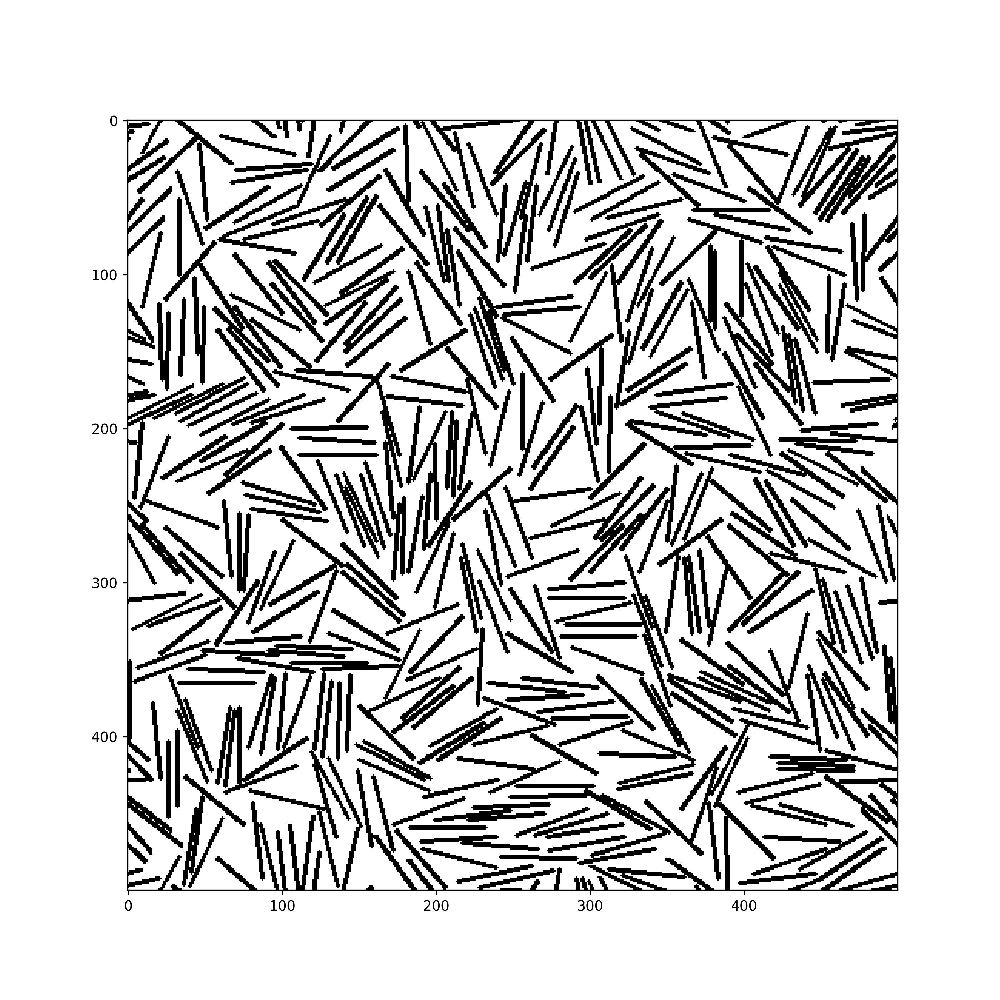
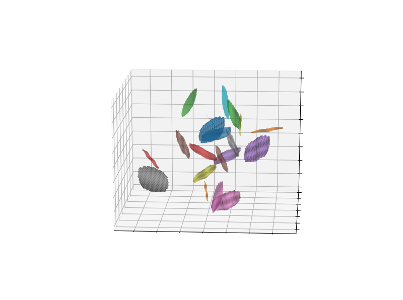

# About the project

This project code can generate geometries filled with non-overlapping or overlapping objects. THe author developed these codes to generate geometries for micro-structures of graphene nanocomposites, and use them as input geometries for numerical modelling.

Examples

2D Geometry with Non-overlapping Straight Lines.

3D Geometry with Non-overlapping Amorphous Flakes.

